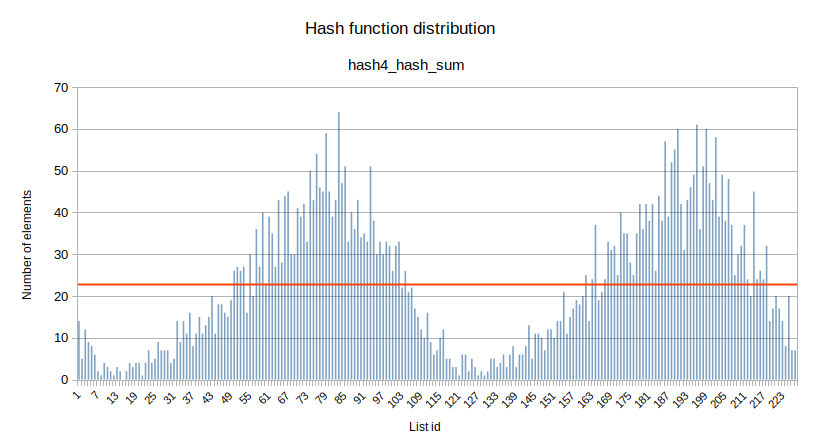
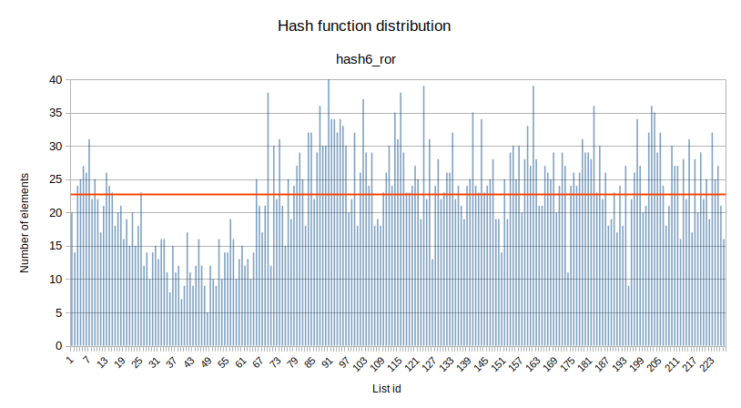
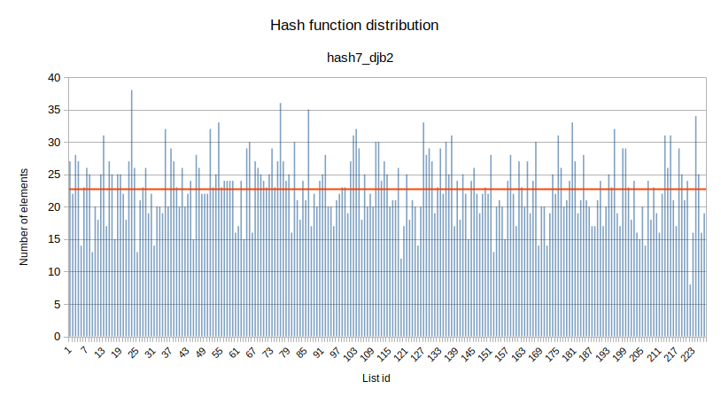
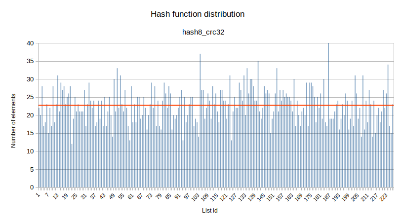

# Введение
Это директория посвящена практическому изучению оптимизации производительности программы. Эта задача будет изучаться на примере структуры данных - хеш-таблицы. Данная работа состоит из двух частей. Первая нацелена на то, чтобы познакомиться со структурой данных - хеш-таблицей, и рассмотреть возможные оптимизации на абстрактном уровне алгоритма, на примере разных хеш-функций. Вторая часть направлена на поиск "узких мест" уже существующего алгоритма и их устранение.

# Цель работы
Основная цель этой работы - это научится правильно анализировать производительность программу и научиться **?оптимизировать как абстрактный алгоритм, так и конкретную реализацию?**

# Задачи
На примере структура данных, хеш-таблицы, сделать два уровня исследования и оптимизации.
На первом уровне анализируется абстрактный алгоритм работы хеш-функций, на втором уровне оптимизируется реализация выбранного алгоритма

# Гипотеза
Чтобы добиться хорошего результата работы программы нужно тщательно исследовать абстрактную модель и её реализацию.

# Теоретическое введение
Для выполнения поставленных целей и задач, как уже было сказано выше, была выбрана одна из стандартных и широко использующихся структур данных: хеш-таблица.
Что такое хеш-таблица?
...

# Ход работы

## Первая часть
Перед тем как начать анализировать абстрактную модель, нужно сначала понять, почему для работы была выбрана именно данная структура данных.

### Почему хеш-таблица?
Хеш-таблица была выбрана неспроста. Это достаточно популярная структура, которая находит широкое применение во всех областях программирования. Так же, хорошо подобранная модель хеш-таблицы имеет множество преимуществ в качестве способа хранения данных. Но у этой модели есть свои недостатки.

*Но какой же главный недостаток?*

Главный минус хеш-таблицы - это большое потребление памяти. Теоретически, эта структура позволяет поиск, добавление и другие операции с её элементами за асимптотическое время О(1). Однако, чтобы это было возможно, необходимо, чтобы каждый элемент имел свой отдельный контейнер. Это означает, что количество занимаемой памяти асимптотически оценивается как О(n), где n - количество элементов. Один из способов уменьшения количества памяти - это наличие коллизий (случаев когда двум разным ключам соответствует один контейнер). Хеш-таблицы считается хорошей, когда в среднем в каждом контейнере ~ 1.5-2 элемента.
Так же важно, что бы элементы были распределены равномерно.

### Постановка цели
Теперь, когда мы определили главные недостаток хеш-таблицы, можно сформулировать цель для исследования в первой части.

**Наша цель**: добится макимально возможного равномерного распределения по контейнерам.

### Модель для исследований
Так как это исследовательская работа, то мы можем позволить себе некоторые изменения модели.
Для хорошей репрезентативности мы будем симулировать ситуацию, когда элементов настолько много, что в каждом контейнере гораздо больше двух элементов. Данная ситуация позволять более отчетливо выявить неравномерность распределения элементов.
Для эксперимента будем добиваться условий, когда в каждом контейнере примерно 10-20 элементов. Для достижения этих параметров будем использовать два метода:
1. большое количество элементов для хранение в структуре данных
2. ограничения количества контейнеров
 
Для выполнения работы в качесве элементов выберем английские слова. В качестве базы данных возьмем произведение Вильяма Шекспира "Гамлет", в котором насчитается около 32 тысяч слов. Преимущество осмысленного в том, что в нем есть определенная закономерность распределения слов, что является важным, так как зачастую в любом массиве данных есть определенные паттерны и закономерности.

В хеш-таблице будут хранится только уникальные слова, которых в данном тексте 5178. Таким образом, наша цель - добится, чтобы в среднем в контейнере было 20-25 элементов. Для этого понадобится примерно около 230 контейнеров. 

Для колличесва контейнеров лучше всего подбирать *простые числа*. Так как, при существовании зависимости между данными, хеш-функции могут выдавать значения с определенными законмерностями, и нахождения остатка от деления на непростое число может быть хуже распределенным, чем при делении на простое. (Подробнее об это можно прочитать например [по этой ссылке](https://medium.com/swlh/why-should-the-length-of-your-hash-table-be-a-prime-number-760ec65a75d1)[^2].)

Ближайшее простое число к 230, это **227**. Именно его возьмем за наше количесво конейнеров.

### Хеш-функции
Теперь, когда мы определились с моделью и параметрами нашей эскпериментальной установки, перейдем к выполнению цели: достижение максимально возможного равномерного распределения.

Хеш-функция - это главный фактор, напрямую определяющий распределение элементов по контейнерам, так как именно она отвечает, в каком контейнере будем хранится элемент. Поэтому первая часть работы будет посвящена исследованию различных хеш-функций.

Выберем восемь различных функций, которые каждому слову сопоставляют:
1. всегда еденицу
2. ASCII код первого символа
3. длину слова
4. сумму ASCII кодов всех символов

Так же используем еще четыре функции, в алгоритм работы которых, мы не будем углубляться в контексте данной работы:
5. rol
6. ror
7. djb2
8. crc32

### Измерения

Теперь посмотрим на распределение элементов по контейнерам для разных функций.

 Таблица распределения по первым 10 контейнерам для всех хеш-функций 

##### таблица 1. Распределение по первым 10 контейнерам для всех хеш-функций
Название функции | 1|   2    | 3  | 4   | 5     | 6     | 7     | 8     | 9     |10
---------------|----|--------|----|-----|-------|-------|-------|-------|-------|------
hash1_always_1 | 0  |	5183 | 0  |	0	| 0	    | 0 	| 0	    | 0	    | 0	    | 0
hash2_ascii    | 0  |	0	 | 0  |	0	| 0	    | 0 	| 0	    | 0	    | 0	    | 0
hash3_strlen   | 0  |	13	 | 74 |	277	| 787	| 964	| 921	| 820	|577	|364
hash4_hash_sum | 14 |	5	 | 12 |	9	| 8     | 6	    | 2     |	1	| 4	    | 3
hash5_rol 	   | 27 |    21	 | 18 |	23	|22	    |24	    | 16	| 17	| 27	| 23
hash6_ror 	   | 20 |	14	 | 24 |	25	| 27	| 26	| 31	| 22	| 25	| 22
hash7_djb2 	   | 27 |	22	 | 28 |	27	| 14	| 23	| 26	| 25	| 13	| 20
hash8_crc32    | 22 |	20	 | 28 |	17	| 18	| 23	| 15	| 22	| 17	| 28

  
Невооруженным глазом видно, что первые три функции имеют плохое распределение. По этомоу отбросим их из дальнейшего рассмотрения.

  
Для анализа оставшихся функций, посторим гистограмы, показывающее распределение по контейнерам.

 Графики распределение функций 

На всех графиком красная линия - это среднее значение количесва элементов в контейнере.

##### гистограмма 1. Распределение функции hash4_hash_sum.

##### гистограмма 2. Распределение функции hash5_rol.

##### гистограмма 3. Распределение функции hash6_ror.

##### гистограмма 4. Распределение функции hash7_dbj2.

z
##### гистограмма 5. Распределение функции hash8_crc32.

  
Из данных гистограм, видно, что `hash4_hash_sum` и `hash6_ror` имеют худшее распределения. Поэтому отбросим их, и сфокусируем внимание на оставшихся трех функциях:
1. `hash5_rol`
2. `hash7_dbj2`
3. `hash8_crc32`

По гистограмам сложно определить функцию с лушим распределнием, поэтому расчитаем дисперсию с для этих трех функций.

##### таблица 2. Дисперсия функий в условных единицах
| Название функции | Дисперсия, у.е.
|------------------|-------------------------------
| `hash5_rol` 	   | 25.18
| `hash7_djb2` 	   | 25.72
| `hash8_crc32`    | 23.99

Из данной таблицы видно, что лучшими показателем (наименьшей дисперсией) обладает функция `hash8_crc32`.

Именно эту функию и выберем для нашей хеш-таблицы.

### Замечение
Важно отметить, что важно учитывать количесво контейнеров. Немного изменив колличество контейнеров, функция с лучшей дисперсией может изменится.
Например, диссперсия данных функций для разного колличесва контейнеров:

##### таблица 3. Дисперсия функий в условных единицах, при разном количестве контейнеров
| Название Функции | 223 контейнеров | 211 контейнеров |229 контейнеров 
|------------------|-----------------|-----------------|-------------
| `hash5_rol` 	   | 24.36           | 24.94           | `20.34`
| `hash7_djb2` 	   | `21.14`         | `22.33`         | 24.65
| `hash8_crc32`    | 28.70           | 25.18           | 20.89

Из этих данных видно, что значения дисперсии флуктуируют, и при таких размерах `hash8_crc32` не является лучшей функцией. 

При выборе хеш-функции нужно не забывать, что "эффективность" хеш-функции зависит от колличесва контейнеров. В некоторых частных случаях, например, когда количесво элементов в таблице является степнью двойки, хорошая хеш-функция может показывать неожиданный результа, плохо распределяя элементы. 

### Выводы из первой части
Понимая, как работает модель хеш-таблицы, мы выявили, что главной характеристикой хеш-таблицы является равномерность-распределения, которая на прямую зависит от типа данных и хеширующей функции.
 
Проанализировав наше установку, мы смогли найти оптимальную хеш функцию, которая позволят достичь достачно равномерного распределения элементов.

## Вторая часть

### Что делать теперь?
В первой части мы анализировали хеш-таблицу как абстрактную модель, не углубляясь в детали ее реализации. Теперь же займемся исследованием конкретной модели, реализованной для этой лабораторной работы.

Первое с чем нужно определится - это какой аспект программы мы будем исследовать. Например, это может быть загрузка таблицы из памяти. Однако, в данной работе нас больше интересует работа с хеш-таблицей, чем ее загрузка или удаление. Поэтому оставим эти оптимизации вне круга нашей работы.

Вернемся к модели хеш-таблицы из первой части. Из-за большего количества коллизий поиск элемента становится затруднительным, так как высчитать хеш элемента уже недостаточно. Поэтому сфокусируемся на задаче поиска элемента.

Первое с чего стоит начать - это тип данных. Важно начать именно с этого, так как это краеугольный камень в нашей модели. От типа данных зависит реализация основных функций, таких как: высчитывание хеша элемента, поиск и сравнение элементов. Поэтому начнем оптимизацию именно с этого.

В данной работе элементы - это слова. Слова удобно представлять в виде векторов. Из [предыдущей работы](https://github.com/ArsenySamoylov/Asm/tree/master/SIMD) по изучению SIMD-инструкций мы знаем о существований специальных функций-интринсиков для работы с 256 битными векторами. Такой вектор позволит хранить слово длиной до 32 букв, что более чем достаточно для наших исходных данных.

Преимущества использования векторов:
1. унификация данных: каждое слово - это 256 битный вектор
2. операции с векторами значительно быстрее, чем работа поотдельности с каждым символом.
   
Недостаки такого способа:
1. Повышения расхода памяти: каждое слово становится 256 битным вектором вне зависимости от его длины.

Этот единственный недостаток можно решить, если вместе с каждым словом хранить его длину и в дальнейшем перейти к неравномерному хранению данных. ??? Так как устранение этого недостака непринципиально в контексте данной работы (хранения длины слова и переход к неравномерному хранению данных, существенно уменьшит потребление памяти и не сильно повлият на производительность, но займет дополнительное время для имплементации в нашей моделе), то его применение будет оставлено вне работы.??? 

Теперь, когда мы определились с типом, которым будут представлены наши данные, перейдем к анализу производительности нашей модели.

Для поиска будем использовать слова из сказки Льюиса Кэрролла "Алиса в Стране чудес". Для просмотра затрачиваемы программой ресурсов  будем использовать профайлер [Callgrind](https://habr.com/ru/articles/167837/).

### Анализ производительности

# Заключение

[^2]: To add line breaks within a footnote, prefix new lines with 2 spaces.
  This is a second line.