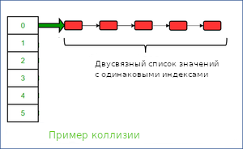

# Введение
В данном репозитории находится работа, посвященная изучению структуры данных - хеш-таблицы.
Исследование состоит из двух частей:
1. Рассмотрение нескольких хеш-функций.
2. Оптимизация поиска в хеш-таблице.

<hr>

# <a name="section-experimental-setup"></a> Экспериментальная установка
Ноутбук фирмы "Acer" на процессоре "Intel(R) Core(TM) i5-10300H CPU @ 2.50GHz" и операционная система "GNU/Linux 22.04.1-Ubuntu x86_64".

# Теоретическое введение
**Хеш-таблица** — это ассоциативный массив, в котором все элементы хранятся в виде пары ключ-значение, где:

*ключ* — уникальное число, которое используется для индексации значений;

*значение* (или элемент) — данные, которые с этим ключом связаны. 

*Хеш-функция* — функция, сопоставляющая ключу число, которое в последствии используется для вычисления индекса в ассоциативном массиве.

Важно, что хеш-функция не обязана выдавать уникальные числа для разных *значений*. Ситуации, когда несколько *значений* имеют одинаковые *ключи*, называют *коллизиями*. Один из способов борьбы с *коллизиями* - это **метод цепочек**.

Суть этого метода проста: если хеш-функция выделяет один индекс разным элементам, то храниться они будут в одном и том же индексе, но уже с помощью списка (далее вместо *индекса* мы будем использовать термин *контейнер* или *список* под данным индексом).

Именно этот метод будем использовать в данной работе.

Визуализация хеш-таблицы методом цепочек, взятом из [данного источника](https://www.geeksforgeeks.org/implementing-our-own-hash-table-with-separate-chaining-in-java/?type=article&id=137749)[^1] (там же можно подробнее узнать о том, как работает хеш-таблица).




# Ход работы

## **Первая часть**
Быстрота взаимодействия с хеш-таблицей напрямую зависит от её заселенности (среднего количества элементов в контейнерах) и равномерности заполнения. Хеш-таблица считается хорошей, когда в среднем в каждом контейнере 1.5-2 элементов.

За основной параметр для исследований в первой части возьмем *равномерность заполнения*.

Для анализа хеш-функций мы будем симулировать ситуацию, когда в каждом контейнере примерно 20-25 элементов. Данная ситуация позволяет более отчетливо выявить неравномерность распределения элементов хеш-функцией.

В качестве элементов выберем английские слова. В хеш-таблице будут храниться только уникальные слова, так как в противном случае на распределение будет так же влиять частота всречи слов.

Главное преимущество хеш-таблицы - это маштабируемость вместительности таблицы. Взаимодействие с хеш-таблицей должно быть быстрым как при маленьких, так и при больших размерах. Поэтому для хорошей репрезентативности мы будем измерять равномерность распределения при трех размерах:
- 227 контейнеров;
- 1,013 контейнеров;
- 10,007 контейнеров;
 
Для количества контейнеров лучше всего подбирать *простые числа*. Так как, при существовании зависимости между данными, хеш-функции могут выдавать значения с определенными закономерностями, и нахождения остатка от деления на непростое число может быть хуже распределенным, чем при делении на *простое*.

### **Хеш-функции**
Выберем восемь различных функций.
Далее будут приведены реализация всех восьми функций вместе с гитограмамми, показывающие распределение при разном количестве контейнеров.

Функции написаны на Си. В каждой функции используется следующие псевдонимы к базовым типам:

```
typedef char data;
typedef unsigned index_t;
```

### **1. hash1_always_1**
```
index_t hash1_always_1 (const data* key)
    {
    assert(key);
    return 1;
    }
```

Данная хеш-функция всегда возвращает единицу. 
Так как все элементы хранятся в одном контейнере, то ниже приведена гистограмма только при одном количестве контейнеров

<details>
<summary> Гистограмма 1. Распределение функции hash1_always_1. </summary>


</details>

### **2. hash2_ascii**
```
index_t hash2_ascii (const data* key)
    {
    assert(key);
    return (index_t) *( (const char *) key);
    }
```
Данная хеш-функция возвращает ASCII код первого символа.
Одной гистограммы для самого маленького набора контейнеров достаточно, чтобы увидеть ограниченность распределения.
<details>
<summary> Гистограмма 2. Распределение функции hash2_ascii. </summary>


</details>

### **3. hash3_strlen**
```
index_t hash3_strlen   (const data* key)
    {
    assert(key);
    return assert(key), (index_t) strlen( (const char*) key);
    }
```
Данная хеш-функция возвращает длину слова.
Одной гистограммы для самого маленького набора контейнеров достаточно, чтобы у видеть ограниченность распределения.

<details>
<summary> Гистограмма 3. Распределение функции hash3_strlen. </summary>


</details>

### **4. hash4_hash_sum**
```
index_t hash4_hash_sum (const data* key)
    {
    assert(key);

    const char* temp = (const char*) key;
    index_t hash_sum = (index_t) *temp;

    while (*temp)
        hash_sum += (index_t) *temp++;

    return hash_sum;
    }
```

Данная хеш-функция возвращает сумму всех ASCII кодов слова.
Распределение этой функции уже интереснее. Только на самом большом количесве кониейнеров видна ограниченость этой функции. 

Специально для этой функции привожу гистограмму для распределения по `5023` контейнерам для лучшей наглядности.

<details>
<summary> Гистограммы 4. Распределение функции hash4_hash_sum. </summary>


</details>

### **5. hash5_rol**
```
static inline index_t rol (index_t val)
    {
    return ((val << 1) | (val >> 31));
    }

index_t hash5_rol (const data* key)
    {
    assert(key);
    
    index_t hash_value = 0;
    const char* temp = (const char*) key;

    while (*temp)
        hash_value = rol (hash_value) ^ (index_t) *(temp++);

    return hash_value;
    }
```
Данная хеш-функия возвращает результат побитовой операции `XOR` элементом строки с промежуточным значением хеша, полученным во время циклического сдвига влево. 

<details>
<summary> Гистограммы 5. Распределение функции hash5_rol. </summary>


</details>

### **6. hash6_ror**
```
static inline index_t ror (index_t val)
    {
    return ((val >> 1) | (val << 31));
    }

index_t hash6_ror (const data* key)
    {
    assert(key);
    
    index_t hash_value = 0;
    const char* temp = (const char*) key;

    while (*temp)
        hash_value = ror (hash_value) ^ (index_t) *(temp++);

    return hash_value;
    }
```
Данная хеш-функция подобна предыдущей, только циклический сдвиг происходит вправо.

<details>
<summary> Гистограммы 6. Распределение функции hash6_ror. </summary>


</details>

### **7. hash7_gnu**
```
index_t hash7_gnu (const data* key)
    {
    assert(key);

    index_t hash = 5381;
    char c = 0;
    
    const char* temp = (const char*) key;

    while (c = *(temp++))
        hash = ((hash << 5) + hash) + (index_t) c;

    return hash;
    }
```
Алгоритм данной хеш-функции использует линейную комбинацию элементов значения с коэффициентами, полученными перемножением простых чисел.

<details>
<summary> Гистограммы 7. Распределение функции hash7_gnu. </summary>


</details>

### **8. hash8_crc32**
```
index_t  hash8_crc32 (const data* key)
  {
    if (!key) return 0;

    const index_t polynomial = 0x04C11DB7;
    const index_t polOldBit  = 1 << 26;

    index_t hash = 0;
    const char* reference = (const char*) key;

    while (*reference)  
        {
        for (int i = 7; i >= 0; i--)
            {
            hash = (hash << 1) + ((*reference >> i) & 1);
            if (hash & polOldBit)
              hash ^= polynomial;
            }

        ++reference;
        }

    return hash;
  }
```

Алгоритм данной хеш-функции можно описать как полиномиального деления(вместо деления - `XOR`) в столбик.

<details>
<summary> Гистограммы 8. Распределение функции hash8_crc32. </summary>


</details>
Расчитаем дисперсии для функций с хорошим с распределением по контейнерам.

<br>

##### **Таблица 1**. Дисперсия функций в условных единицах
| Название Функции | 227 контейнеров | 1,013 контейнеров |10,007 контейнеров 
|------------------|-----------------|-------------------|-------------
| `hash1_always_1` | 118341          | 216404            | -
| `hash2_ascii`    | 4639            | 126212            | -
| `hash3_strlen`   | 15770           | 21565             | -
| `hash4_hash_sum` | 265             | 104               | 30333
| `hash5_rol`      | 25.18           | 21.68             | 102
| `hash6_ror`      | 54.09           | 36.38             | 489
| `hash7_gnu`      | 25.72           | 14.99             | `20.52`
| `hash8_crc32`    | `23.99`         | `14.76`           | 20.85

### Вывод из первой части
Из полученных данных видно, что лучшими показателями (наименьшей дисперсией) обладают функции `hash7_gnu` и `hash8_crc32`.

...

## **Вторая часть**

<hr>

### *Замечание*
Далее во второй части все версии тестовой модели будут компилироваться с флагом оптимизации `-О3`
<hr>

### **Что делаем теперь?**
Первое с чем нужно определится - какой аспект программы мы будем исследовать. 

Например, это может быть загрузка таблицы из памяти. Однако в основном хеш-таблица - это структура данных, которая долго живет в программе. И соответственно загрузка и удаление таблицы занимают заметно меньшее время по сравнению с временем жизни структуры. Поэтому оставим эти оптимизации вне круга нашей работы.

Вернемся к хеш-таблице из первой части.
Из-за большего количества коллизий поиск элемента становится затруднительным, так как высчитать хеш элемента уже недостаточно. Поэтому сфокусируемся на задаче поиска элемента.   

### **Тестирование**
Создадим тестовую ситуацию, когда мы ищем большое количество элементов в хеш-таблице. Для этого в цикле будем искать слова, которыми заполнена хеш-таблица.

Для просмотра затрачиваемых программой ресурсов будем использовать профайлер [Callgrind](https://habr.com/ru/articles/167837/)[^3], являющийся встроенным инструментом в утилиту [Valgrind](https://valgrind.org/)[^4].

Теперь посмотрим на статистику нашей программы (цифрами обозначается общее количество выполненых машинных инструкций):

<details>
<summary> Приложение 1. Статистика неоптимизированной версии тестирующей программы. </summary>


</details>
<br /> 

Из данной таблицы видно, что большая часть машинных инструкций уходит на вычисление хеша. Поэтому начнем оптимизации именно с этой функций.

#### **Оптимизация хеш-функции**
Начнем оптимизации с самой ресурсозатратной функции - функции хеширования, а именно `hash8_crc32_not_optimized`. 

В данной работе элементы - это слова. В начальной реализации базовым типом был массив символов. 
Однако слова удобно представлять в виде векторов, так как это позволяет работать со словом целиком, а не с каждым символом по отдельности. Поэтому перейдем от строки произвольной длины, к строке фиксированной длины.

Для оптимизации функции, высчитывающей хеш, возможны следующие действия:
1. Написать её на ассемблере,
2. Написать её на инлайн ассемблере (ассемблерная вставка),
3. Написать её на [интрисиках](https://github.com/ArsenySamoylov/Asm/tree/master/SIMD)[^5].

[Наша экспериментальная установка](#section-experimental-setup) имеет встроенную аппаратную поддержку хеширования crc32.
Так же экспериментальная установка имеет набор инструкции `AVX2`, позволяющий использовать вектор максимальной длиной до 32 байт, что более чем достаточно для наших исходных данных.
   
Реализуем все три вида оптимизированной функции хеширования и проанализируем их.

<details>
<summary> Реализации разных оптимизаций </summary>

Функция расчета хеша, написанная на ассемблере:
```
.global hash8_crc32_assembler

 hash8_crc32_assembler:
    cmp $0x0, %rdi
    je .end

    crc32q     (%rdi), %rax
    crc32q 0x08(%rdi), %rax 
    crc32q 0x10(%rdi), %rax 
    crc32q 0x18(%rdi), %rax

    .end:

    ret
```
С помощью инлайн-ассемблера:
```
index_t hash8_crc32_inline_as (const data* key)
    {
    int64_t res = 0;
    
    asm (
        R"(
         .intel_syntax noprefix
          cmp %1, 0x0
          je 1f
          
          xor %0, %0

          crc32 %0, qword ptr [%1 + 0x00 ]
          crc32 %0, qword ptr [%1 + 0x08 ]
          crc32 %0, qword ptr [%1 + 0x10 ]
          crc32 %0, qword ptr [%1 + 0x18 ]
        1:
       
        .att_syntax prefix
        )"
            : "=r"(res)
            : "r"(key), "r"(res) 
      );

    return (index_t) res;
    }
```
Через интринсики:
```
index_t hash8_crc32_intrinsics (const data* key)
    {
    __m256i element = _mm256_loadu_si256 (key);
    
    index_t hash = _mm_crc32_u32(0, _mm256_extract_epi64 (element, 0));
    
    hash = _mm_crc32_u32(hash, _mm256_extract_epi64 (element, 1));
    hash = _mm_crc32_u32(hash, _mm256_extract_epi64 (element, 2));
    hash = _mm_crc32_u32(hash, _mm256_extract_epi64 (element, 3));
    
    return hash;
    }
```
</details>

#### **Таблица ?.** Сравнение времени для разных реализаций  функции хеширования

Реализация функции       | Время тестирования, секунды
-------------------------|---------------------------------
`hash8_crc32_assembler`  | 29.0
`hash8_crc32_inline_as`  | 19.3
`hash8_crc32_intrinsics` | 15.7

Из таблицы видно, что функция на интринсиках показала лучший результат.

### **Inline** 
Рассмотрим, как можно еще лучше оптимизировать функцию хеширования.

Функция расчета хеша достаточно компактна, поэтому компилятор может подставить ее напрямую в функцию вместо вызова, тем самым уменьшая количество инструкций. Посмотрим, как изменятся показателей функций, если сделать их инлайн версии.

Теперь замерим время для функции.

#### **таблица ?.** Сравнение инлайн функций
Функция                  | Время, секунды
-------------------------|---------------------------------
`hash8_crc32_assembler`  | 29.0
`hash8_crc32_inline_as`  | 19.0
`hash8_crc32_intrinsics` | 15.3

Используя опцию компилятора `save-temps` посмотрим, как компилятор  подставляет код:

Сгенерированный ассемблерный код для функции написанной на инлайн-ассемблере:

```
FindElementInHashTable:
          ...
         .intel_syntax noprefix
          cmp %rax, 0x0
          je 1f
          
          xor %rdi, %rdi

          crc32 %rdi, qword ptr [%rax + 0x00 ]
          crc32 %rdi, qword ptr [%rax + 0x08 ]
          crc32 %rdi, qword ptr [%rax + 0x10 ]
          crc32 %rdi, qword ptr [%rax + 0x18 ]
        1:
       
        .att_syntax prefix
        ...
```

Код для функции, использующей интринсики:

```
FindElementInHashTable:
        ...
        xorl    %eax, %eax
        crc32l  (%rdi), %eax
        crc32l  8(%rdi), %eax
        crc32l  16(%rdi), %eax
        crc32l  24(%rdi), %eax
        movl    %eax, -4(%rsp)
        xorl    %eax, %eax
        ...
```

Отсюда видно, что компилятор действительно подставил код вместо вызова функции.

Однако компилятор не может сделать это для функции, написанной на ассемблере.
```
FindElementInHashTable:
    ...
    call    hash8_crc32_assembler@PLT
    ...
```

Из этого можно сделать вывод, что при оптимизации лучше использовать ассемблерную вставку или интринсики вместо написания функции на чистом ассемблере.

Остановимся на выборе лучшей функции - использующей интринсики.
Замерим, на сколько изменилось время поиска:

#### **таблица ?.** Результаты первой оптимизации

Версия программы                | Время поиска, секунды | f*ck
--------------------------------|-----------------------|---------
без оптимизаций                 | 29.3                  | -
версия с первой оптимизацией    | 15.3                  |

### **Оптимизация сравнения элементов**
ДОбавить про каллграф


Как показала предыдущая оптимизация наибольший прирост дает использование функции на интринсиках. Перепишем функцию сравнения строк с помощью интринсиков.

<details> 
<summary> Функция сравнения на интринсиках </summary>

```
static inline int cmp_vectors (__m256i a, __m256i b)
    {
    __m256i pcmp = _mm256_cmpeq_epi8(a, b); 
    unsigned bitmask = (unsigned) _mm256_movemask_epi8(pcmp);
    
    return (bitmask == 0xffffffffU);
    }
```
</details>
<br /> 

Замерим, на сколько изменилось время поиска:

#### **таблица 6.**
Версия программы                | Время поиска, секунды     | Прирост относительной прошлой версии 
--------------------------------|---------------------------|-----
без оптимизаций                 | 29.3                      | -
первая оптимизация              | 15.3                      |
первая и вторая оптимизации     | 11.7                      | 

### **Оптимизация проверок и деления**
Посмотрим, как теперь выглядит затраты функций.

<details> 
<summary> приложение 2. Статистика приложения после первых двух оптимизаций.  </summary>


</details>
<br /> 

Из графа видно, что значительную часть занимает уже оптимизированная функция `FindElementInList_optimized `. 

Посмотрим на исходник первой функции:

<details> 
<summary> Функция поиска элемента в контейнере</summary>

```
Node* FindElementInList (const List* list, const data* element)
    {
    assert(list);
    assert(element);

    if (list->number_of_elements == 0)
        return NULL;
    
    __m256i element_data = _mm256_load_si256 (element);
   
    Node* current_node = list->first_node;
    
    while (current_node)
        {
        __m256i current_node_data = _mm256_loadu_si256 (current_node->data_ptr); 
        
        if (cmp_vectors(current_node_data, element_data))
                return current_node;

        current_node = current_node->next;
        }
    
    return NULL;
    }
```
</details>
<br /> 

Инлайн функция `cmp_vectors` уже оптимизирована с помощью интринсиков. Поэтому единственный способ оптимизировать эту функцию, это поменять алгоритм поиска элемента внутри списка, что за рамками наших оптимизаций.

Посмотрим на исходники следуйщей по ресурсозатратности функции `FindElementInHashTable`:

<details> 
<summary> Функция поиска элемента в хеш-таблице </summary>

```
data* FindElementInHashTable (const HashTable* table, const data* element)
    {
    assert(table);
    assert(element);
    
    index_t hash_index = (hash8_crc32_itrinsics_inline(element)) 
                         % ((index_t) table->number_of_lists);
        
    Node* result = FindElementInList (table->list_array + hash_index, element);
    
    if (!result)
        return NULL;

    return result->data_ptr;
    }   
```

</details>
<br /> 

Так как это уже финальная версия программы, то можно отключить дополнительные проверки:
- `CheckList`, проверяющая структуру `List` (контейнер в наших терминах) на возможные ошибки,
- assert`ы.

#### **таблица ?.** ???
Версия программы                | Время поиска, секунды     | Относительный прирост 
--------------------------------|---------------------------|-----
оптимизации + проверки          | 11.7                      | -
оптимизации без проверок        | 11.2                      | 

Последнее, что можно оптимизировать в этой функции - это операцию поиска остатка от деления. `table->number_of_lists` - задается константой времени компиляции, поэтому если вместо её использования подставить константу, то компилятор сможет оптимизировать нахождение остатка.

<details> 
<summary> Генерирующийся код для поиска остатка от деления </summary>

Код без использования константы:
```
FindElementInHashTable_crc32:
        ...
        xorl    %edx, %edx
        divl    240168(%rdi)
        xorl    %ebx, %ebx
        leaq    (%rdx,%rdx,2), %rax
        leaq    (%rdi,%rax,8), %rdi
        callq   FindElementInList 
        ...
```

Код с использованием константы:
```
FindElementInHashTable_crc32:
        ...
        imulq   $1757988013, %rax, %rcx         # imm = 0x68C8C4AD
        shrq    $44, %rcx
        imull   $10007, %ecx, %ecx              # imm = 0x2717
        subl    %ecx, %eax
        leaq    (%rax,%rax,2), %rax
        leaq    (%rdi,%rax,8), %rdi
        callq   FindElementInList
        ...
```
</details>

#### **таблица 7.**
Версия программы                | Время поиска, секунды     | Относительный прирост 
----------------------------------|---------------------------|-----
оптимизации + проверки            | 11.7                      | -
оптимизации без проверок          | 11.2                      | 
оптимизации поиска в хеш-таблице  | 10.9                      | 

### Завершение оптимизации

<details> 
<summary> приложение 3. Графы вызовов функций </summary> 


Подведем итоги всех оптимизаций


#### **таблица 7.** Итоги оптимизаций
Версия программы                      | Время поиска, секунды     | Прирост относительной прошлой версии | Прирост относительно первой версии
--------------------------------------|---------------------------|--------------------------------------|-------
без оптимизаций                       | 3.61                      | -                                    | -
первая оптимизация                    | 2.70                      | 1.34                                 | 1.34
первая и вторая оптимизации           | 2.11                      | 1,28                                 | 1.71
все оптимизации и отключение проверок | 2.08                      | 1.01                                 | 1.74

# Заключение
В ходе работы, мы изучили структуру данных - хеш-таблицу. 

Был произведен анлиз абстрактной модели, в ходе которого был определен один из главных факторов, влиящих на эффективность структуры данных, и подобраны оптимальные параметры для конкретной ситуации использования хеш-таблицы.

После этого, были сделаны предположения по возможным сценариям использования хеш-таблицы. И, исходя из этого, были произведены оптимизации, позволившие ускорить работу с хеш-таблицой в 1.74 раза. 

## Ресурсы
[^1]: https://codechick.io/tutorials/dsa/dsa-hash-table
[^2]: https://medium.com/swlh/why-should-the-length-of-your-hash-table-be-a-prime-number-760ec65a75d1
[^3]: https://habr.com/ru/articles/167837/
[^4]: https://valgrind.org/
[^5]: https://github.com/ArsenySamoylov/Asm/tree/master/SIMD