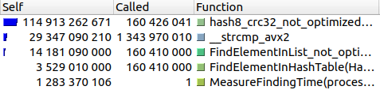
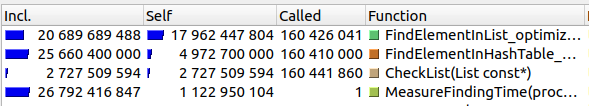

# Введение
В данном репозитории находится работа, посвященная изучению структуры данных - хеш-таблицы.
Исследование состоит из двух частей:
1. Рассмотрение нескольких хеш-функций.
2. Оптимизация поиска в хеш-таблице.

<hr>

# <a name="section-experimental-setup"></a> Экспериментальная установка
Ноутбук фирмы "Acer" на процессоре "Intel(R) Core(TM) i5-10300H CPU @ 2.50GHz" и операционная система "GNU/Linux 22.04.1-Ubuntu x86_64".

# Теоретическое введение
**Хеш-таблица** — это ассоциативный массив, в которой все элементы хранятся в виде пары ключ-значение, где:

*ключ* — уникальное число, которое используется для индексации значений;

*значение* (или элемент) — данные, которые с этим ключом связаны. 

*Хеш-функция* — функция, сопоставляющая ключу число, которое в последствии используется для вычисления индекса в ассоциативном массиве.

Важно, что хеш-функция не обязана выдавать уникальные числа для разных *значений*. Ситуации, когда несколько *значений* имеют одинаковые *ключи*, называют *коллизиями*. Хеш-таблицы делятся на разные типы, по тому как они борются с *коллизиями*. Два основных способа:
1. метод цепочек
2. метод открытой адресации

В данной работе мы будем использовать метод цепочек. 

Суть этого метода проста: если хеш-функция выделяет один индекс сразу двум элементам, то храниться они будут в одном и том же индексе, но уже с помощью двусвязного списка (далее вместо *индекса* мы будем использовать термин *контейнер*,  имея в виду двусвязный список *значений*).

Визуализация хеш-таблицы методом цепочек, взятом из [данного источника](https://www.geeksforgeeks.org/implementing-our-own-hash-table-with-separate-chaining-in-java/?type=article&id=137749)[^1]. (там же можно подробнее узнать о том, как работает хеш-таблица)


# Ход работы

## **Первая часть**
Эффективность хеш-таблицы напрямую зависит от её заселенности (среднего количества элементов в контейнерах) и равномерности заполнения. Хеш-таблица считается хорошей, когда в среднем в каждом контейнере ~ 1.5-2 элемента.

*Равномерность заполнения* возьмем за основной параметр для исследований в первой части.

### **Параметры для исследования**
Для анализа хеш-функций мы будем симулировать ситуацию, когда элементов настолько много, что в каждом контейнере гораздо больше двух элементов. Данная ситуация позволяет более отчетливо выявить неравномерность распределения элементов хеш-функцией.

Для эксперимента будем добиваться условий, когда в каждом контейнере примерно 20-25 элементов. 

В качестве элементов выберем английские слова. В хеш-таблице будут храниться только уникальные слова. Важно хранить только уникальные слова, так как в противном случае на распределение будет так же влиять частота всречи слов.

Главные преимущества хеш-таблицы - это простота и хорошая масштабируемость. Хеш-таблица должна быть эфективна как при маленьких, так и при больших размерах. Поэтому для хорошей репрезентативности мы будем измерять равномерность распределения при трех размерах:
- 227 контейнеров;
- 1,013 контейнеров;
- 10,007 контейнеров;
 
Для количества контейнеров лучше всего подбирать *простые числа*. Так как, при существовании зависимости между данными, хеш-функции могут выдавать значения с определенными закономерностями, и нахождения остатка от деления на непростое число может быть хуже распределенным, чем при делении на *простое*.

### **Хеш-функции**
Выберем восемь различных функций.
Далее будут приведены реализация всех восми функций вместе с гитограмамми, показывающие распределение при разном количестве контейнеров

Функции написаны на Си. В каждой функции используется следующие синонимы к базовым типам:

```
typedef char data;
typedef unsigned index_t;
typedef index_t (*hash_func_ptr) (const data*);
```

### **1. hash1_always_1**
```
index_t hash1_always_1 (const data* key)
    {
    assert(key);
    return 1;
    }
```

Данная хеш-функция всегда возвращает еденицу. 
Так-как все элементы хранятся в одном контейнере, то ниже приведена гистограмма только при одном количестве контейнеров

<details>
<summary> Гистограмма 1. Распределение функции hash1_always_1. </summary>


</details>

### **2. hash2_ascii **
```
index_t hash2_ascii (const data* key)
    {
    assert(key);
    return (index_t) *( (const char *) key);
    }
```
Данная хеш-функция возвращает ASCII код первого символа.
Гистограммы для самого маленького набора контейнеров достаточно, чтобы у видеть ограниченность распределения.
<details>
<summary> Гистограмма 2. Распределение функции hash2_ascii. </summary>


</details>

### **3. hash3_strlen**
```
index_t hash3_strlen   (const data* key)
    {
    assert(key);
    return assert(key), (index_t) strlen( (const char*) key);
    }
```
Данная хеш-функция возвращает длину слова.
Гистограммы для самого маленького набора контейнеров достаточно, чтобы у видеть ограниченность распределения.

<details>
<summary> Гистограмма 3. Распределение функции hash3_strlen. </summary>


</details>

### **4. hash4_hash_sum**
```
index_t hash4_hash_sum (const data* key)
    {
    assert(key);

    const char* temp = (const char*) key;
    index_t hash_sum = (index_t) *temp;

    while (*temp)
        hash_sum += (index_t) *temp++;

    return hash_sum;
    }
```

Данная хеш-функция возвращает сумму всех ASCII кодов слова.
Распределение этой функции уже интереснее. Только на самом большом распределении видна ограниченость этой функции. Специально для этой функции привожу гистограмму для распределения по `5023` контейнерам для лучшей наглядности.

<details>
<summary> Гистограммы 4. Распределение функции hash4_hash_sum. </summary>


</details>

### **5. hash5_rol**
```
static inline index_t rol (index_t val)
    {
    return ((val << 1) | (val >> 31));
    }

index_t hash5_rol (const data* key)
    {
    assert(key);
    
    index_t hash_value = 0;
    const char* temp = (const char*) key;

    while (*temp)
        hash_value = rol (hash_value) ^ (index_t) *(temp++);

    return hash_value;
    }
```
Данная хеш-функия возвращает сумму элементов полученного во время циклического сдвига вправо. 

<details>
<summary> Гистограммы 5. Распределение функции hash5_rol. </summary>


</details>

### **6. hash6_ror**
```
static inline index_t ror (index_t val)
    {
    return ((val >> 1) | (val << 31));
    }

index_t hash6_ror (const data* key)
    {
    assert(key);
    
    index_t hash_value = 0;
    const char* temp = (const char*) key;

    while (*temp)
        hash_value = ror (hash_value) ^ (index_t) *(temp++);

    return hash_value;
    }
```
Данная хеш-функция подобна предыдущей, только циклический сдвиг происходит влево.

<details>
<summary> Гистограммы 6. Распределение функции hash6_ror. </summary>


</details>

### **7. hash7_gnu**
```
index_t hash7_gnu (const data* key)
    {
    assert(key);

    index_t hash = 5381;
    char c = 0;
    
    const char* temp = (const char*) key;

    while (c = *(temp++))
        hash = ((hash << 5) + hash) + (index_t) c;

    return hash;
    }
```
Алгоритм данной хеш-функции использует линейную комбинацию элементов значения с коэффициентами, полученными перемножением простых чисел.

<details>
<summary> Гистограммы 7. Распределение функции hash7_gnu. </summary>


</details>

### **8. hash8_crc32**
```
index_t  hash8_crc32 (const data* key)
  {
    if (!key) return 0;

    const index_t polynomial = 0x04C11DB7;
    const index_t polOldBit  = 1 << 26;

    index_t hash = 0;
    const char* reference = (const char*) key;

    while (*reference)  
      {
            for (int i = 7; i >= 0; i--)
          {
            hash = (hash << 1) + ((*reference >> i) & 1);
            if (hash & polOldBit)
              hash ^= polynomial;
          }
        ++reference;
      }

    return hash;
  }
```

Алгоритм данной хеш-функции можно описать как полиномиального деления(вместо деления - исключающее или) в столбик.

<details>
<summary> Гистограммы 8. Распределение функции hash8_crc32. </summary>


</details>
Расчитаем дисперсию для распределения функций по контейнерам (для первых трех функций значение дисперсии при 10,007 контейнерах не измерялась).

##### **Таблица 1**. Дисперсия функций в условных единицах
| Название Функции | 227 контейнеров | 1,013 контейнеров |10,007 контейнеров 
|------------------|-----------------|-------------------|-------------
| `hash1_always_1` | 118341          | 216404            | -
| `hash2_ascii`    | 4639            | 126212            | -
| `hash3_strlen`   | 15770           | 21565             | -
| `hash4_hash_sum` | 265             | 104               | 30333
| `hash5_rol`      | 25.18           | 21.68             | 102
| `hash6_ror`      | 54.09           | 36.38             | 489
| `hash7_gnu`      | 25.72           | 14.99             | `20.52`
| `hash8_crc32`    | `23.99`         | `14.76`           | 20.85

Из данной таблицы видно, что лучшими показателями (наименьшей дисперсией) обладают функции `hash7_gnu` и `hash8_crc32`.

## **Вторая часть**

### *Замечание*
Далее во второй части все версии тестовой модели будут компилироваться с флагом оптимизации `-О3`
<hr>

### **Что делаем теперь?**
Первое с чем нужно определится - какой аспект программы мы будем исследовать. 

Например, это может быть загрузка таблицы из памяти. Однако в основном хеш-таблица - это структура данных, которая долго живет в программе. И соответственно загрузка и удаление таблицы занимают заметное меньшее время по сравнению с временем жизни структуры. Поэтому оставим эти оптимизации вне круга нашей работы.

Вернемся к хеш-таблице из первой части.
Из-за большего количества коллизий поиск элемента становится затруднительным, так как высчитать хеш элемента уже недостаточно. Поэтому сфокусируемся на задаче поиска элемента.   

### **Тестирование**
Создадим тестовую ситуацию, когда мы ищем большое множество элементов в хеш-таблице. Для этого в цикле будем искать слова, которыми заполнена хеш-таблица.

Для просмотра затрачиваемых программой ресурсов будем использовать профайлер [Calgrind](https://habr.com/ru/articles/167837/)[^3], являющийся встроенным инструментом в утилиту [Valgrind](https://valgrind.org/)[^4].

Теперь посмотрим на статистику нашей программы (цифрами обозначается общее количество выполненых машинных инструкций, выполненных в функции):

<details>
<summary> Приложение 1. Статистика неоптимизированной версии тестирующей программы. </summary>



</details>
<br /> 

Из данного графа видно, что большая часть машинных инструкций уходит на вычисление хеша и сравнение строк. Поэтому начнем оптимизации именно с этих функций.

#### Оптимизация хеш-функции
Начнем оптимизации с самой ресурсозатратной функции - функции хеширования, а именно `hash8_crc32_not_optimized`. 

В данной работе элементы - это слова. В начальной реализации базовым типом был массив символов. 
Однако слова удобно представлять в виде векторов, так как это позволяет работать со словом целиком, а не с каждым символом по отдельности.

Поэтому перейдем от строки произвольной длины, к строке фиксированной длины.

Для оптимизации функции, высчитывающей хеш, возможны следующие действия:
1. написать её на ассемблере,
2. написать её на инлайн ассемблере (ассемблерная вставка),
3. написать её на [интрисиках](https://github.com/ArsenySamoylov/Asm/tree/master/SIMD)[^5].

[Наша экспериментальная установка](#section-experimental-setup) имеет встроенную аппаратную поддержку хеширования crc32.
Так же экспериментальная установку набор инструкции `AVX`, позволяющий использовать вектор максимальной длиной до 32 байт.

Во всех реализация достаточно использовать вектор 32 байт, способный хранить слово длиной до 32 букв, что более чем достаточно для наших исходных данных.
   
Реализуем все три вида и проанализируем их.

<details>
<summary> Реализации разных оптимизаций </summary>

Функция расчета хеша, написанная на ассемблере:
```
.global hash8_crc32_assembler

 hash8_crc32_assembler:
    cmp $0x0, %rdi
    je .end

    crc32q     (%rdi), %rax
    crc32q 0x08(%rdi), %rax 
    crc32q 0x10(%rdi), %rax 
    crc32q 0x18(%rdi), %rax

    .end:

    ret
```
С помощью инлайн-ассемблера:
```
index_t hash8_crc32_inline_as (const data* key)
    {
    int64_t res = 0;
    
    asm (
        R"(
         .intel_syntax noprefix
          cmp %1, 0x0
          je 1f
          
          xor %0, %0

          crc32 %0, qword ptr [%1 + 0x00 ]
          crc32 %0, qword ptr [%1 + 0x08 ]
          crc32 %0, qword ptr [%1 + 0x10 ]
          crc32 %0, qword ptr [%1 + 0x18 ]
        1:
       
        .att_syntax prefix
        )"
            : "=r"(res)
            : "r"(key), "r"(res) 
      );

    return (index_t) res;
    }
```
Через интринсики:
```
index_t hash8_crc32_intrinsics (const data* key)
    {
    __m256i element = _mm256_loadu_si256 (key);
    
    index_t hash = _mm_crc32_u32(0, _mm256_extract_epi64 (element, 0));
    
    hash = _mm_crc32_u32(hash, _mm256_extract_epi64 (element, 1));
    hash = _mm_crc32_u32(hash, _mm256_extract_epi64 (element, 2));
    hash = _mm_crc32_u32(hash, _mm256_extract_epi64 (element, 3));
    
    return hash;
    }
```
</details>

#### **таблица ?.** Сравнение времени для разных реализации  функции хеширования

Реализации функции       | Время поиска в тестовой программе, секунды
-------------------------|---------------------------------
`hash8_crc32_assembler`  | 29.0
`hash8_crc32_inline_as`  | 19.3
`hash8_crc32_intrinsics` | 15.7

Из таблицы видно, что функция на интринсиках показала лучший результат.

Функция расчета хеша достаточно компакта, поэтому компилятор может подставить ее напрямую в функцию поиска элемента, тем самым уменьшая количество инструкций. Посмотрим, как изменятся показателей функций, если сделать их инлайн версии.

Теперь замерим время для функции.

#### **таблица ?.** Сравнение инлайн функций
Функция                  | Время, секунды
-------------------------|---------------------------------
`hash8_crc32_assembler`  | 29.0
`hash8_crc32_inline_as`  | 19.0
`hash8_crc32_intrinsics` | 15.3

Используя опцию компилятора `save-temps` посмотрим, как компилятор  подставляет код:

Фрагмент исходной строчки

```
volatile index_t temp = hash8_crc32_assembler (test_data_array++);
```

Сгенерированный ассемблерный код для функции написанной на инлайн-ассемблере:

```
.LVL1:
#APP
# 28 "./include/HashFunctions.hpp" 1
    
         .intel_syntax noprefix
          cmp %rax, 0x0
          je 1f
          
          xor %rdi, %rdi

          crc32 %rdi, qword ptr [%rax + 0x00 ]
          crc32 %rdi, qword ptr [%rax + 0x08 ]
          crc32 %rdi, qword ptr [%rax + 0x10 ]
          crc32 %rdi, qword ptr [%rax + 0x18 ]
        1:
       
        .att_syntax prefix
```

Код для функции, использующей интринсики:

```
.LVL1:
#APP
# 28 "./include/HashFunctions.hpp" 1
xorl    %eax, %eax
        crc32l  (%rdi), %eax
        crc32l  8(%rdi), %eax
        crc32l  16(%rdi), %eax
        crc32l  24(%rdi), %eax
        movl    %eax, -4(%rsp)
        xorl    %eax, %eax
```

Отсюда видно, что компилятор действительно подставил код вместо вызова функции.

Однако компилятор не может сделать это для функции, написанной на ассемблере.
```
.LVL10:
    .loc 1 98 54 view .LVU42
    call    hash8_crc32_assembler@PLT
```

Из этого можно сделать вывод, что при оптимизации лучше использовать ассемблерную вставку или интринсики вместо написания функции на чистом ассемблере.

Остановимся на выборе функции написанной на интринсиках.
Замерим, на сколько изменилось время поиска:

#### **таблица 6.** Результаты первой оптимизации
Версия программы                | Время поиска, секунды |
--------------------------------|-----------------------|---------
без оптимизаций                 | 29.3                  |
версия с первой оптимизацией    | 15.3                  |

### **Оптимизация сравнения элементов**
Как показала предыдущая оптимизация наибольший прирост дает использование функции на интринсиках. Перепишем функцию сравнения строк с помощью интринсиков.

<details> 
<summary> Функция сравнения на интринсиках </summary>

```
static inline int cmp_vectors (__m256i a, __m256i b)
    {
    __m256i pcmp = _mm256_cmpeq_epi8(a, b); 
    unsigned bitmask = (unsigned) _mm256_movemask_epi8(pcmp);
    
    return (bitmask == 0xffffffffU);
    }
```
</details>
<br /> 

Замерим, на сколько изменилось время поиска:

#### **таблица 6.**
Версия программы                | Время поиска, секунды     | Прирост относительной прошлой версии 
--------------------------------|---------------------------|-----
без оптимизаций                 | 29.3                      | -
первая оптимизация              | 15.3                      |
первая и вторая оптимизации     | 11.7                      | 

### Оптимизация проверок и деления
Посмотрим, как теперь выглядит  функций программы.

<details> 
<summary> приложение 2. Статистика приложения после первых двух оптимизаций.  </summary>



</details>
<br /> 

Из графа видно, что значительную часть занимает уже оптимизированная функция `FindElementInList_optimized ` и `FindElementInHashTable`.

Посмотрим на исходник первой функции:

<details> 
<summary> Функция поиска элемента в контейнере</summary>

```
Node* FindElementInList (const List* list, const data* element)
    {
    assert(list);
    assert(element);

    if (list->number_of_elements == 0)
        return NULL;
    
    __m256i element_data = _mm256_load_si256 (element);
   
    Node* current_node = list->first_node;
    
    while (current_node)
        {
        __m256i current_node_data = _mm256_loadu_si256 (current_node->data_ptr); 
        
        if (cmp_vectors(current_node_data, element_data))
                return current_node;

        current_node = current_node->next;
        }
    
    return NULL;
    }
```
</details>
<br /> 

Инлайн функция `cmp_vectors` уже оптимизирована с помощью интринсиков. Поэтому единственный способ оптимизировать эту функцию, это поменять алгоритм поиска элемента внутри списка, что превосходит наши задачи по оптимизации.

Посмотрим на исходники второй функции `FindElementInHashTable`:

<details> 
<summary> Функция поиска элемента в хеш-таблице </summary>

```
data* FindElementInHashTable (const HashTable* table, const data* element)
    {
    assert(table);
    assert(element);
    
    index_t hash_index = (hash8_crc32_itrinsics_inline(element)) 
                         % ((index_t) table->number_of_lists);
        
    Node* result = FindElementInList (table->list_array + hash_index, element);
    
    if (!result)
        return NULL;

    return result->data_ptr;
    }   
```

</details>
<br /> 

Так как это уже финальная версия программы, то можно отключить дополнительные проверки:
- `CheckList`, проверяющая структуру `List` (контейнер в наших терминах) на возможные ошибки,
- assert`ы.

#### **таблица 7.**
Версия программы                | Время поиска, секунды     | Относительный прирост 
--------------------------------|---------------------------|-----
оптимизации + проверки          | 11.7                      | -
оптимизации без проверок        | 11.2                      | 

Последнее, что можно оптимизировать в этой функции - это операцию поиска остатка от деления. `table->number_of_lists` - константа времени компиляции, поэтому если заменить её на константу, то компиляторо сможет оптимизировать нахождение остатка.

<details> 
<summary> Генерирующийся код для поиска остатка от деления </summary>

Код без использования константы:
```
FindElementInHashTable_crc32:
        ...
        xorl    %edx, %edx
        divl    240168(%rdi)
        xorl    %ebx, %ebx
        leaq    (%rdx,%rdx,2), %rax
        leaq    (%rdi,%rax,8), %rdi
        callq   FindElementInList 
        ...
```

Код с использованием константы:
```
FindElementInHashTable_crc32:
        ...
        imulq   $1757988013, %rax, %rcx         # imm = 0x68C8C4AD
        shrq    $44, %rcx
        imull   $10007, %ecx, %ecx              # imm = 0x2717
        subl    %ecx, %eax
        leaq    (%rax,%rax,2), %rax
        leaq    (%rdi,%rax,8), %rdi
        callq   FindElementInList
        ...
```
</details>

#### **таблица 7.**
Версия программы                | Время поиска, секунды     | Относительный прирост 
----------------------------------|---------------------------|-----
оптимизации + проверки            | 11.7                      | -
оптимизации без проверок          | 11.2                      | 
оптимизации поиска в хеш-таблице  | 10.9                      | 

### Завершение оптимизации

<details> 
<summary> приложение 3. Графы вызовов функций </summary> 


Подведем итоги всех оптимизаций


#### **таблица 7.** Итоги оптимизаций
Версия программы                      | Время поиска, секунды     | Прирост относительной прошлой версии | Прирост относительно первой версии
--------------------------------------|---------------------------|--------------------------------------|-------
без оптимизаций                       | 3.61                      | -                                    | -
первая оптимизация                    | 2.70                      | 1.34                                 | 1.34
первая и вторая оптимизации           | 2.11                      | 1,28                                 | 1.71
все оптимизации и отключение проверок | 2.08                      | 1.01                                 | 1.74

# Заключение
В ходе работы, мы изучили структуру данных - хеш-таблицу. 

Был произведен анлиз абстрактной модели, в ходе которого был определен один из главных факторов, влиящих на эффективность структуры данных, и подобраны оптимальные параметры для конкретной ситуации использования хеш-таблицы.

После этого, были сделаны предположения по возможным сценариям использования хеш-таблицы. И, исходя из этого, были произведены оптимизации, позволившие ускорить работу с хеш-таблицой в 1.74 раза. 

## Ресурсы
[^1]: https://codechick.io/tutorials/dsa/dsa-hash-table
[^2]: https://medium.com/swlh/why-should-the-length-of-your-hash-table-be-a-prime-number-760ec65a75d1
[^3]: https://habr.com/ru/articles/167837/
[^4]: https://valgrind.org/
[^5]: https://github.com/ArsenySamoylov/Asm/tree/master/SIMD