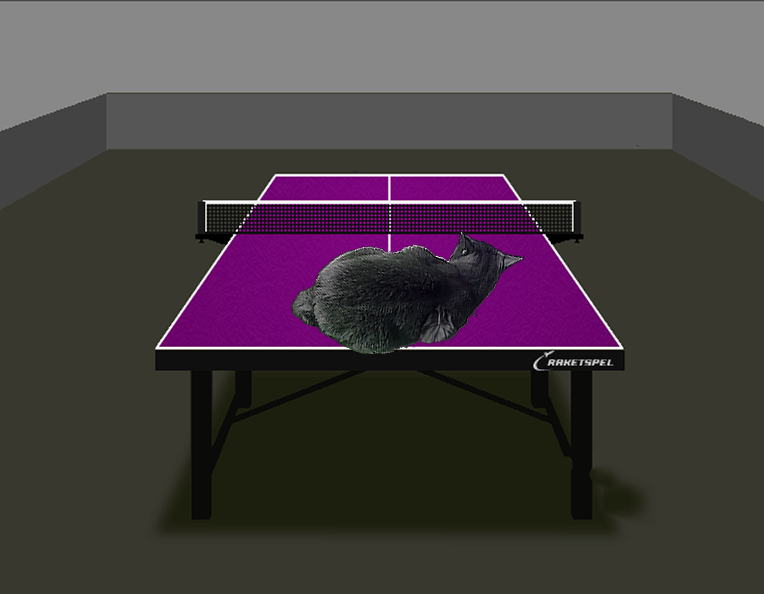

### Пример Альфаблендига двух изображений


### Что такое Альфаблендинг
Альфаблендинг - это один из способов совмещения двух изображений, использующий альфа канал (это канал использется для задает прозрачность пикселя)
Для базового типа изображений был выбран BMP 32bpp в силу своей простоты. В этом формаье изображение хранится как двумерный массив пикселей, где цвет каждого пикселя кодируется 32 битами (8 битов на кадждый канал RGBA, reg green blue alpha)

### Формула рассчетов
Для расчетов была выбрана самая простая формула расета цвета, где значения альфа канала переднего цвета умножается кадый канал цвета переднего пикаселя. Аналогично цвет заднего пикселя умнодается на 255 - альфа_переднего. Полученные значения складвыются делятся на 256.

### Использование SIMD инструкций
Базыовый тип для храниения цвета одного пикселя - int32. AVX позволяет работать одновременно с 8-мью пикселями

### Примеры кода
Сразу заметно, что код, написсаный на intrinsic-ах заметно объемнее и менее читабельный. Так же, хорошо формулирующийся алгоритм быстро и понятно пишется при помощи стандартных методов, а код при использовании intrinsic-ов заметно дольше и тяжелее. Написание неоптимизированной функции у меня заняло около 20-30 минут (с учетом отладки), в то время как на оптимизированную версию с intrinsic-ами потребовалось несколько часов.

#### Стандартная функция
```
int Blend_not_optimized (Image* front_img, Image* back_img, unsigned x_start, unsigned y_start)
    {
    const unsigned front_width = front_img->width;
    const unsigned  back_width =  back_img->width;

    const unsigned front_height = front_img->height;

    uint32_t*  back_color_array = (uint32_t*)  back_img->pixel_arr + (y_start * back_img->width + x_start); 
    uint32_t* front_color_array = (uint32_t*) front_img->pixel_arr;


    for (unsigned y_coord = 0; y_coord < front_height; y_coord++)
        {

        uint32_t* back_arr  =  back_color_array + y_coord * back_width; 
        uint32_t* front_arr = front_color_array + y_coord * front_width; 

        for (unsigned x_coord = 0; x_coord < front_width; x_coord++)
            {
            uint64_t  back_color = (uint64_t)  *back_arr; 
            uint64_t front_color = (uint64_t) *front_arr;

            uint8_t alpha_front = (uint8_t) (front_color >> 24);
           
            uint64_t new_red_green = ((front_color & 0x00FF00FF) * (alpha_front) + 
                                       (back_color & 0x00FF00FF) * (256 - alpha_front)) 
                                     >> 8;

            uint64_t new_alph_blue = ((front_color & 0xFF00FF00) * (alpha_front) + 
                                       (back_color & 0xFF00FF00) * (256 - alpha_front)) 
                                     >> 8;
            
            new_red_green &= 0x00FF00FF;
            new_alph_blue &= 0xFF00FF00;
           
            *back_arr = (uint32_t) (new_red_green + new_alph_blue); 

            back_arr++;
            front_arr++;
            }
        
        back_arr += back_img->width - front_img->width;
        }

    return SUCCESS;
    }
```
#### С использованием AVX
```
int Blend_optimized (Image* front_img, Image* back_img, unsigned x_start, unsigned y_start)
    {
    __m256i _zero_m256i = _mm256_setzero_si256 ();
    __m256i  _255_m256i = _mm256_set1_epi16 ( (short int)0xFF00);

    const unsigned front_width = front_img->width;
    const unsigned  back_width =  back_img->width;

    const unsigned front_height = front_img->height;

    uint32_t*  back_color_array = (uint32_t*)  back_img->pixel_arr + (y_start * back_img->width + x_start); 
    uint32_t* front_color_array = (uint32_t*) front_img->pixel_arr;

    for (unsigned y_coord = 0; y_coord < front_height; y_coord++)
      {    
      
      uint32_t* back_arr  =  back_color_array + y_coord * back_width; 
      uint32_t* front_arr = front_color_array + y_coord * front_width; 
    
        for (unsigned x_coord = 0; x_coord < front_width - 7; x_coord += 256/32)
            {
            
            // load from memory 
            // lddqu becase memory can be not alligned
            __m256i  back_color = _mm256_lddqu_si256 ((__m256i*)  back_arr); 
            __m256i front_color = _mm256_lddqu_si256 ((__m256i*) front_arr);
            
            // unpack 8-bit value to 16-bit 
            __m256i back_color_low  = _mm256_unpacklo_epi8 (_zero_m256i, back_color);
            __m256i back_color_high = _mm256_unpackhi_epi8 (_zero_m256i, back_color);

            __m256i front_color_low  = _mm256_unpacklo_epi8 (_zero_m256i, front_color);
            __m256i front_color_high = _mm256_unpackhi_epi8 (_zero_m256i, front_color);

           // get alfa values from front pixel
            __m256i alpha_front_low  = _mm256_shufflehi_epi16 (front_color_low,  _MM_SHUFFLE(3,3,3,3)); 
                    alpha_front_low  = _mm256_shufflelo_epi16 (alpha_front_low,  _MM_SHUFFLE(3,3,3,3));
            
            __m256i alpha_front_high = _mm256_shufflehi_epi16 (front_color_high, _MM_SHUFFLE(3,3,3,3));
                    alpha_front_high = _mm256_shufflelo_epi16 (alpha_front_high, _MM_SHUFFLE(3,3,3,3));
            
            // then multiply, storing only high 16-bits of intermediate 32-bit value
            front_color_low  = _mm256_mulhi_epu16 (front_color_low,  alpha_front_low);
            front_color_high = _mm256_mulhi_epu16 (front_color_high, alpha_front_high);

            __m256i anti_alpha_low  =  _mm256_sub_epi16 (_255_m256i, alpha_front_low);
            __m256i anti_alpha_high =  _mm256_sub_epi16 (_255_m256i, alpha_front_high);
            
            back_color_low  = _mm256_mulhi_epu16 (back_color_low,  anti_alpha_low);
            back_color_high = _mm256_mulhi_epu16 (back_color_high, anti_alpha_high);
            
            // sum and truncuate
            __m256i sum_low  = _mm256_add_epi16 (front_color_low,  back_color_low);
            __m256i sum_high = _mm256_add_epi16 (front_color_high, back_color_high);
            
            __m256i sum_low_trunc  = _mm256_srli_epi16 (sum_low, 8);
            __m256i sum_high_trunc = _mm256_srli_epi16 (sum_high, 8);

            // store result
            __m256i result_color = _mm256_packus_epi16 (sum_low_trunc, sum_high_trunc);
            _mm256_storeu_si256 ((__m256i*) back_arr, result_color);

            back_arr  += 8;
            front_arr += 8;
            }
        
        back_arr += back_width - front_width;
      }


    return SUCCESS;
    }
```
### Генерирующийся машинный код
Посмотрим какой машинный код сгенерировал компилятор для каждой из функций. Сразу можно заметить, что, если иходные версии значительного отличались по объему кода, то колличестово машшиных команд в них примерное одинаковой. Это можно объяснить тем, что данные intrinsic-и посути являются ассемблерными командами. Следовательно писание кода  их помощью аналогично написанию ассемблерного кода. Эти хорошо объяснятеся большой объем исходного кода и сложночть его написания. 
#### Обычный код
```
Blend_not_optimized(Image*, Image*, unsigned int, unsigned int):
        pushq   %r15
        pushq   %r14
        pushq   %r13
        pushq   %r12
        pushq   %rbp
        pushq   %rbx
        subq    $40, %rsp
        testq   %rdi, %rdi
        je      .L19
        testq   %rsi, %rsi
        je      .L20
        movl    8(%rdi), %r12d
        movl    8(%rsi), %r14d
        movq    %rdi, %rax
        movl    12(%rdi), %r10d
        movl    12(%rsi), %r8d
        cmpl    %r12d, %r14d
        jb      .L4
        cmpl    %r10d, %r8d
        jb      .L4
        imull   %r14d, %ecx
        movq    (%rax), %rax
        movq    (%rsi), %rsi
        movq    %rax, (%rsp)
        leal    (%rcx,%rdx), %edi
        testl   %r10d, %r10d
        je      .L10
        movl    %r12d, %eax
        movl    %r14d, 12(%rsp)
        xorl    %r15d, %r15d
        xorl    %r13d, %r13d
        movq    %rsi, 16(%rsp)
        leaq    0(,%rax,4), %rcx
        xorl    %ebp, %ebp
        movl    $256, %ebx
        movq    %rdi, 24(%rsp)
        movq    %rcx, %r11
.L9:
        movq    24(%rsp), %rsi
        movl    %r13d, %eax
        addq    %rsi, %rax
        movq    16(%rsp), %rsi
        leaq    (%rsi,%rax,4), %r9
        movq    (%rsp), %rsi
        movl    %r15d, %eax
        leaq    (%rsi,%rax,4), %r8
        leaq    (%r8,%r11), %r14
        testl   %r12d, %r12d
        je      .L12
        movl    %r12d, 8(%rsp)
.L11:
        movl    (%r8), %esi
        movl    (%r9), %ecx
        movl    %ebx, %edi
        addq    $4, %r8
        addq    $4, %r9
        movq    %rsi, %rax
        shrq    $24, %rsi
        movl    %ecx, %r12d
        andl    $-16711936, %ecx
        movl    %eax, %edx
        subl    %esi, %edi
        andl    $16711935, %r12d
        andl    $-16711936, %eax
        movslq  %edi, %rdi
        imulq   %rsi, %rax
        andl    $16711935, %edx
        imulq   %rsi, %rdx
        imulq   %rdi, %r12
        imulq   %rdi, %rcx
        addq    %r12, %rdx
        addq    %rcx, %rax
        shrq    $8, %rdx
        shrq    $8, %rax
        andl    $16711935, %edx
        andl    $4278255360, %eax
        addl    %eax, %edx
        movl    %edx, -4(%r9)
        cmpq    %r14, %r8
        jne     .L11
        movl    8(%rsp), %r12d
.L12:
        movl    12(%rsp), %eax
        addl    $1, %ebp
        addl    %r12d, %r15d
        addl    %eax, %r13d
        cmpl    %r10d, %ebp
        jne     .L9
.L10:
        addq    $40, %rsp
        xorl    %eax, %eax
        popq    %rbx
        popq    %rbp
        popq    %r12
        popq    %r13
        popq    %r14
        popq    %r15
        ret
.L4:
        movl    %r14d, %ecx
        movl    %r12d, %esi
        movl    %r10d, %edx
        movl    $.LC4, %edi
        xorl    %eax, %eax
        call    printf
        addq    $40, %rsp
        movl    $1, %eax
        popq    %rbx
        popq    %rbp
        popq    %r12
        popq    %r13
        popq    %r14
        popq    %r15
        ret
```
#### Код с использованием SIMD инструкциий
```
Blend_optimized(Image*, Image*, unsigned int, unsigned int):
        pushq   %rbp
        movq    %rsp, %rbp
        pushq   %r15
        pushq   %r14
        pushq   %r13
        pushq   %r12
        pushq   %rbx
        andq    $-32, %rsp
        subq    $32, %rsp
        testq   %rdi, %rdi
        je      .L18
        testq   %rsi, %rsi
        je      .L19
        movl    8(%rdi), %ebx
        movl    8(%rsi), %r12d
        movl    12(%rdi), %r13d
        movl    12(%rsi), %r8d
        cmpl    %ebx, %r12d
        jb      .L4
        cmpl    %r13d, %r8d
        jnb     .L5
.L4:
        movl    %r12d, %ecx
        movl    %r13d, %edx
        movl    %ebx, %esi
        movl    $.LC4, %edi
        xorl    %eax, %eax
        call    printf
        leaq    -40(%rbp), %rsp
        movl    $1, %eax
        popq    %rbx
        popq    %r12
        popq    %r13
        popq    %r14
        popq    %r15
        popq    %rbp
        ret
.L5:
        imull   %r12d, %ecx
        movq    (%rdi), %r8
        movq    stdout(%rip), %rdi
        movq    (%rsi), %r14
        xorl    %esi, %esi
        movq    %r8, 24(%rsp)
        leal    (%rcx,%rdx), %r15d
        xorl    %ecx, %ecx
        movl    $2, %edx
        call    setvbuf
        testl   %r13d, %r13d
        movq    24(%rsp), %r8
        je      .L10
        movl    $-256, %eax
        leal    -7(%rbx), %esi
        xorl    %r10d, %r10d
        xorl    %r9d, %r9d
        vmovd   %eax, %xmm5
        xorl    %edi, %edi
        vpxor   %xmm4, %xmm4, %xmm4
        vpbroadcastw    %xmm5, %ymm5
.L9:
        movl    %r9d, %eax
        movl    %r10d, %edx
        addq    %r15, %rax
        leaq    (%r8,%rdx,4), %rcx
        xorl    %edx, %edx
        leaq    (%r14,%rax,4), %rax
        cmpl    $7, %ebx
        je      .L11
.L8:
        vlddqu  (%rcx), %ymm2
        vlddqu  (%rax), %ymm0
        addl    $8, %edx
        addq    $32, %rax
        addq    $32, %rcx
        vpunpcklbw      %ymm2, %ymm4, %ymm7
        vpunpckhbw      %ymm2, %ymm4, %ymm2
        vpunpcklbw      %ymm0, %ymm4, %ymm1
        vpshufhw        $255, %ymm7, %ymm6
        vpshufhw        $255, %ymm2, %ymm3
        vpunpckhbw      %ymm0, %ymm4, %ymm0
        vpshuflw        $255, %ymm6, %ymm6
        vpshuflw        $255, %ymm3, %ymm3
        vpmulhuw        %ymm6, %ymm7, %ymm7
        vpmulhuw        %ymm3, %ymm2, %ymm2
        vpsubw  %ymm6, %ymm5, %ymm6
        vpsubw  %ymm3, %ymm5, %ymm3
        vpmulhuw        %ymm6, %ymm1, %ymm1
        vpmulhuw        %ymm3, %ymm0, %ymm0
        vpaddw  %ymm7, %ymm1, %ymm1
        vpaddw  %ymm2, %ymm0, %ymm0
        vpsrlw  $8, %ymm1, %ymm1
        vpsrlw  $8, %ymm0, %ymm0
        vpackuswb       %ymm0, %ymm1, %ymm0
        vmovdqu %ymm0, -32(%rax)
        cmpl    %esi, %edx
        jb      .L8
.L11:
        addl    $1, %edi
        addl    %r12d, %r9d
        addl    %ebx, %r10d
        cmpl    %r13d, %edi
        jne     .L9
        vzeroupper
.L10:
        leaq    -40(%rbp), %rsp
        xorl    %eax, %eax
        popq    %rbx
        popq    %r12
        popq    %r13
        popq    %r14
        popq    %r15
        popq    %rbp
        ret
```
