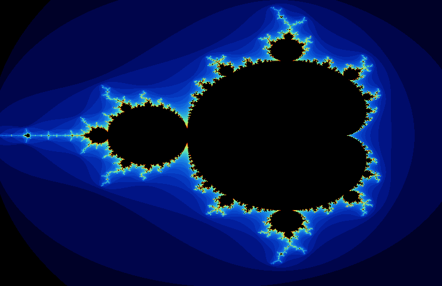

### Пример множества Мандельброта, создаваемого программой

### Алгоритм рассчета точек
Множество Мандельброта - это математический объект, в суть которого мы погружаться не будем. В кратце: Есть исходные кординаты точек, с которыми на каждом шаге цикл происходят определенные преобразовнаия, котоорые, при определенном условии останавливаются. Колличество произведденных итераций преобразовнаий над исходной точкой явяется ключевой характеристкикой, которая определяет цвет, в который юудет окрашена точка. 

### Испоьзование SIMD инструкциий
такая задача хорошо показывает преимущество использования SIMD инструкции при вычислениях. Базовым типом для координат ялвяется int32. С ипользованием XMM и YMM регистров можно одновременно обрабатывпть 8 чисел типа int32
