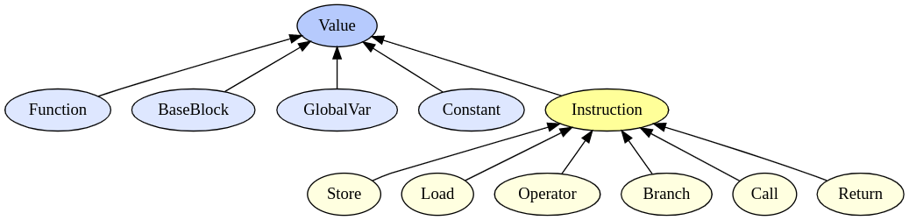

# Вкратце
Данный репозиторий является продолжением моего проекта по созданию компилятора для собственного простого [языка программирования](https://github.com/ArsenySamoylov/Lang.git). Данная часть посвящена Backend`у для х86 архитектуры.

# Следующая итерация 
В контексте данной работы Backend - это программа переводящая Абстрактно-синтаксическое дерево (AST) в код для `исполнителя`. В первой итерации работы `исполнителем` был написанной мной [SoftCpu](https://github.com/ArsenySamoylov/CoreIArs.git), который имеет стековую архитектуру и небольшую область памяти, а также может выполнять простые математические операции. 

Главными изменениями в этой итерации стали:
- переход со стековой архитектуры на регистровую,
- переход с виртуального исполнителя на физический (в данном случае это Intel Core i5-10300H 2.50GHz)
- введение промежуточного представления программы - IR код;

Начнем с IR кода. 

Работа компилятора разделена на три части Frontend, Middlend и Backend. Так как это независимые части, то между ними общий вид передачи программы. В предыдущей итерации в этой роли выступало AST дерево и разработанный нашей учебной группой специальный [стандарт](https://github.com/dodokek/LanguageStandart.git) его хранения. Однако AST дерево слишком не похоже на мушиную реализацию программы и соответственно большая часть задачи по оптимизации перекладываются на Backend, что рушит смысл разделения компилятора на три части.

Поэтому возникает необходимость в промежуточном представлении программы, которое больше бы походило на машинный код. 

Так как мы переходим на регистровую архитектуру, то будем ориентироваться на уже готовые решения в этом направлении. 
Самым известным и распространённым решением является IR от [LLVM` a](https://llvm.org/docs/LangRef.html). 
 
Взяв его за основу, я реализовал собственный простейший IR. 
Если это проект получит продолжение, то следующей итерацией будет переход на полноценное использование IR от LLVM.

**Замечание:**
Я решил сделать собственную реализацию простейшего IR в учебных целях. Дальнейшее его развитие, на данный момент, не имеет смыслы =(.

## Описание моего IR`a

IR реализован с помощью классов и наследования на языке `C++`. 

Основной выступает абстрактный класс `Value`, который хранит `name` - имя объекта (так же Value хранит константу - тип конкретного объекта, что на самом деле является излишним; однако я решил оставить поле, так как это может пригодиться при отладке программы). От этого абстрактного класса наследуются классы:
- `Constant`    - константа, хранит число,
- `GlobalVar`   - глобальная переменная, хранит указатель на `Constant` - начальное значение переменной,
- `Instruction` - абстрактный класс инструкций, которые выполняются исполнителем;
- `BaseBlock`   - массив `Instruction` `ов, которые должны выполняться последовательно (подробнее об этом будет написано позже),
- `Function`    - функция, хранит массив `BaseBlock` `ов,

Данная иерархия описана в файле [`src/IR/Value.h`](src/IR/Value.h).

Как было написано выше `Instruction` - это абстрактный клас, от которого наследуются классы: 
- `Store` - инструкция выделения памяти для объекта `Value`, хранит указатель на `Value`,
- `Load` - инструкция загрузи `Value` в память, хранит указатели на источник (src) и приемник (dest),
- `Operator` - математический или логическая операция, хранит указатели на операнды,
- `Branch` - инструкция передачи контроля, хранит указатель на условие и два указателя на базовые блоки (ветки); в соответствии c условием выбирается один из двух базовых блоков (веток), которому перейдет контроль выполнения программы (*замечание*: `Branch` это более удобный аналог инструкции `jmp`),
- `Call` - вызов функции, хранит имя вызываемой функции и аргументы,
- `Return` - инструкция возврата из функции, хранит указатель на возвращаемое значение. 

Данная иерархия описана в файле [`srs/IR/Instructions.h`](src/IR/Instructions.h).

Класс `Module`, определенный в  [`src/IR/Module.h`](src/IR/Module.h), является массивом объектов `Function` и `GlobalVar`. Объект `Module` представляет собой исходную программу на моем языке.

### Диаграмма иерархии классов в IR`e


### Диаграмма Module в IR`e
<p align="center">


</p>

Как было сказано выше - базовые блоки (`BaseBlock`) это массив инструкций, которые будут выполняться последовательно. Каждый базовый блок заканчивается инструкций передающей контроль - `Return` или `Branch`. 
Благодаря последовательному исполнению инструкций возможно оптимально распределять регистры внутри базового блока. 

Однако существует проблема оптимизации использования регистров между базовыми блоками. Это проблема достаточна сложна, поэтому мы не будем рассматривать её в данной итерации проекта.

## Пример
Рассмотрим пример простой программы на моем языке.
Программа высчитывает факториал от заданной константы:

```
double factorial (var number)
    {
    if (number > 1)
    	return number * factorial (number - 1);
    
    return 1;
    } 
    
double main ()
    {
    var result = factorial (6); 
    fout << result;
    
    return 0;
    }
```

Её `IR` представление:
```
extern function 'fout' ();

Declare function 'factorial' (param number):
entry_factorial:
	%op_0 = bigger number, 1
	br %op_0, label than_0, label merge_0

than_0:
	%op_2 = sub number, 1
	%c_1 = call: factorial (param %op_2)
	%op_3 = mul number, %c_1

	return %op_3
	br label merge_0

merge_0:

	return 1


Declare function 'main' ():
entry_main:
	%c_0 = call: factorial (param 6)
	result = store(%c_0)
	call: fout (param result)

	return 0
```
Здесь `declare` обозначает начало определения функции, метка - начало базового блока. 

Каждая инструкция представляет собой переменную, которая может дальше использовать программой. Данный синтаксис призван подчеркнуть это, например:

```
    %op_2 = sub number, 1
    %c_1 = call: factorial (param %op_2)
```
Здесь `%op_2` -  это результат разности является переменной, служащий аргументом для `call` a. А `%c_1` - это переменная хранящая возвращаемое значение вызова (если функция ничего не возвращает, то  присваивание переменой опускается, как в строчке с вызовом `fout`).

При генерации исполняемого файла так же генерируется ассемблерный файл, подробно расписывающий как происходила генерация машинных команд. Это файл компилируется и сохраняет логику программы. С его помощью легко можно создать контрольный исполняемый файл, который помогает проверять правильность генерации машинных кодов.

Для удобства, в ассемблерном файле печатается исходная строчка из IR`a в виде комментария (строки начинающиеся с `###`), после чего идет ассемблерная реализация данной строчки.

**Замечание:**

Исходная итерация имела особенность: исполнитель работал с вещественными числами заданной точностью, храня их в виде целых чисел. Для этого число домножается на константу `PRECISION` (в данном случае равной 100). Данная итерация унаследовала эту особенность. Поэтому например при умножении двух чисел результат нормируется: делится на 100.

<details>
<summary> Генерирующийся ассемблерный файл для данной программы </summary>

```
	.global main
	.extern fout

	.section .text
_start:
	call main 
	movq $0   , %rdi      
	movq $60  , %rax      
	syscall

factorial:
	# set stack frame (1 local vars)
	sub $8, %rsp 
	push %rbp     
	mov %rsp,   %rbp      

	# save callee-save regs
	push %rbx     
	push %r10     
	push %r11     
	push %r12     
	push %r13     
	push %r14     
	push %r15     

	# save param regs on stack
	movq %rdi, -8 (%rbp)  # Save 'number' on stack


entry_factorial:
### %op_0 = bigger number, 1
	movq $100 , %r15      # put_value_to_reg: ' const_0' -> %r15
						  # put_value_to_reg: 'number' already in %rdi

	mov %rdi,   %r14      # save 'number' to %r14

	# (generating logic op) #
	push %rdx     # (save %rdx)

	cmpq %r15, %rdi
	setg %al
	movzbq %al, %rax

	# (normalize result) #
	xor %rdx, %rdx
	movq $100 , %rdi      
	imul %rdi
	mov %rax,   %rdi      # (-> normalized result)

	pop %rdx              # (restore %rdx)

### br %op_0, label than_0, label merge_0
						  # put_value_to_reg: '%op_0' already in %rdi
	cmp $100, %rdi
	je than_0 
	jmp merge_0 


than_0:
### %op_2 = sub number, 1
	movq $100 , %rdi      # put_value_to_reg: ' const_1' -> %rdi
						  # put_value_to_reg: 'number' already in %r14

	mov %r14,   %r15      # save 'number' to %r15

	# (math op) #
	sub %rdi, %r14


### %c_1 = call: factorial (param %op_2)
	# (save busy regs) #
	# (set parameters) # 
	mov %r14,   %rdi      
	call factorial 
	mov %rax,   %rdi      # save call result from rax

### %op_3 = mul number, %c_1
						  # put_value_to_reg: '%c_1' already in %rdi
						  # put_value_to_reg: 'number' already in %r15

	mov %r15,   %r14      # save 'number' to %r14

	# (generating mul/div)#
	push %rdx    	      # (save %rdx)
	xor %rdx, %rdx
	mov %r15,   %rax      
	imul %rdi

	# (normalize result)  #
	xor %rdx, %rdx
	movq $100 , %r15      
	idiv %r15
	mov %rax,   %r15      # (-> normalized result)

	pop %rdx              # (restore %rdx)

### return %op_3
	
	mov %r15,   %rax      # return %op_3
	
	# (restore callee-save regs)
	pop %r15              
	pop %r14              
	pop %r13              
	pop %r12              
	pop %r11              
	pop %r10              
	pop %rbx              

	# (clear stack frame)
	pop %rbp              
	add $8, %rsp 
	ret 

### br label merge_0
	jmp merge_0 


merge_0:
### return 1
	
	movq $100 , %rax      # return const_2
	# restore callee-save regs
	pop %r15              
	pop %r14              
	pop %r13              
	pop %r12              
	pop %r11              
	pop %r10              
	pop %rbx              

	# clear stack frame
	pop %rbp              
	add $8, %rsp 
	ret 


main:
	# set stack frame (1 local vars)
	sub $8, %rsp 
	push %rbp     
	mov %rsp,   %rbp      

	# save callee-save regs
	push %rbx     
	push %r10     
	push %r11     
	push %r12     
	push %r13     
	push %r14     
	push %r15     

	# save param regs on stack


entry_main:
### %c_0 = call: factorial (param 6)
	# save busy regs
	# set parameters 

	movq $600 , %rdi      
	call factorial 
	mov %rax,   %rdi      # save call result from rax

### result = store(%c_0)
						  # put_value_to_reg: '%c_0' already in %rdi
	movq %rdi, -8 (%rbp)  # copy '%c_0' to stack (to 'result')

### call: fout (param result)
	# save busy regs
	push %rdi     # save: %c_0
	# set parameters 
	movq -8 (%rbp), %rdi  
	call fout 
	pop %rdi              

### return 0
	
	movq $0   , %rax      # return const_1
	# restore callee-save regs
	pop %r15              
	pop %r14              
	pop %r13              
	pop %r12              
	pop %r11              
	pop %r10              
	pop %rbx              

	# clear stack frame
	pop %rbp              
	add $8, %rsp 
	ret 
```

</details>

## Стандартная библиотека
Для полноценной использования языка необходима библиотека, реализующая простейшие стандартные функции. Моя реализация некоторых функций находится в файле `src/Elf/stdlib.s`. 
Машинный код стандартных функций берется из файла `src/Elf/stdlib.o` и добавляется в конец  исполняемого файла. 

Для создания контрольной программы с помощью генерирующегося ассемблерного кода, нужно линковать `src/Elf/stdlib.o`.

# Итог:
В завершении работы замерим, как изменилось время работы программы на моем языке. Для сравнения будем использовать пример факториала из данной работы, но без вывода результата.

### Таблица: время расчета факториала от 15, 1000 раз

Исполнитель |Время, мс | Коэффициент прироста
------------|----------|--------------------
SoftCpu     | 70       | -
core i5     | 1.2      | 56.6

Получается, что в новой итерации исполнение программы ускорилось более чем в 50 раз! Хороший показатель (спасибо ребятам из *Intel* за такой мощный процессор ;)).